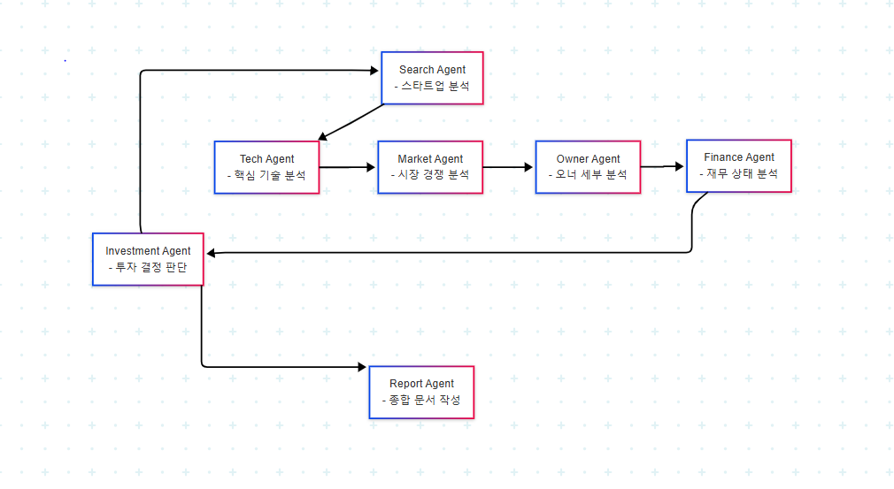

# AI Startup Investment Evaluation Agent

국내외 AI 스타트업에 대해 조사하고 기술력, 시장성, 재무 상태 등을 고려해 투자 판단을 내리는 에이전트를 설계하고 구현한 실습 프로젝트입니다.

## Overview

- Objective
  - AI 스타트업의 핵심 기술력, 시장성, 재무 상태 등을 기반으로 투자 적합성 분석하는 에이전트 시스템 구축
- Method
  - LangGraph + Agentic RAG 
- Tools
  - LLM: OpenAI GPT-4  
  - Web Search: Serper API (Google 기반 검색)  
  - Vector DB: Chroma + SentenceTransformer  
  - Orchestration: LangGraph  
  - Env 관리: python-dotenv  

## Features

- PDF 자료 기반 정보 추출 (예: IR 자료, 기사 등)
- 투자 기준별 판단 분류 (시장성, 팀, 기술력 등)
- 종합 투자 요약 출력 (예: 투자 유망 / 보류 / 회피)

## Tech Stack 

| Category   | Details                      |
|------------|------------------------------|
| Framework  | LangGraph, LangChain, Python |
| LLM        | GPT-4o-mini via OpenAI API   |
| Retrieval  | FAISS, Chroma                |

## Agents
 
- Search Agent: 스타트업 분석
- Tech Agent: 핵심 기술 분석
- Market Agent: 시장 경쟁 분석
- Owner Agent: 오너 세부 분석
- Finance Agent: 재무 상태 분석
- Investment Agent: 투자 결정 판단
- Report Agent: 종합 문서 작성

## Architecture


## Directory Structure
```
project-root/
│
├── data/                  # 스타트업 리스트 및 관련 문서
│   ├── startups.csv
│   └── sample2.pdf
│
├── agents/                # 평가 기준별 Agent 모듈
│   ├── search_agent.py
│   ├── tech_agent.py
│   ├── market_agent.py
│   ├── owner_agent.py
│   ├── finance_agent.py
│   ├── investment_agent.py
│   └── report_agent.py
│
├── prompts/               # 프롬프트 템플릿 및 기준
│   ├── base_templates.py
│   └── scoring_criteria.json
│
├── outputs/               # 평가 결과 및 보고서 저장
│   ├── results.json
│   └── final_report.md
│
├── app.py                 # 전체 분석 실행 스크립트
└── README.md              # 프로젝트 설명
```

## Contributors 
- 강창진
- 김민혁
- 김준혁
- 김효준
